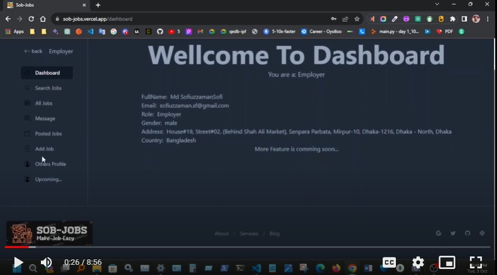

<h1 align="center">
SOB-JOBS
</h1>

<br/>

This is a [NextJS](https://nextjs.org/) project create with [`create-next-app`](https://github.com/vercel/next.js/tree/canary/packages/create-next-app).

### Live Preview site: [Sob-Jobs](https://sob-jobs.vercel.app/)

### server-site: [sob-jobs-server](https://sob-jobs-server-via-cli.vercel.app)
### server-Demo: [sob-jobs-live-demo](https://drive.google.com/file/d/1eS-0KH2XoqCemHbG1hLxM0N-nQvMOkjE/view?usp=sharing)


## Live Demo

[
](https://drive.google.com/file/d/1eS-0KH2XoqCemHbG1hLxM0N-nQvMOkjE/view?usp=sharing)

<br/>
<br/>

```bash
With-Cookies    : https://sob-job.vercel.app  ( Work Only Localhost )
Without-Cookies : https://sob-jobs.vercel.app
```

<br/>

## Cloning and Installing dependencies

First clone this project:

```bash
git clone https://github.com/SofiuzzamanSofi/sob-jobs.git
```

Then install dependencies and modules files:

```bash
npm install
#or
npm i
#or
yarn
#or
pnpm
```
## Getting Started

Email & Passwork:

```bash
Employer:
        email: employer@gmail.com
        password: 123456
Candidate:
        email:user@gmail.com
        password: 123456
```

First, run the development server:

```bash
npm run dev
# or
yarn dev
# or
pnpm dev
```

Open [http://localhost:3000](http://localhost:3000) with your browser to see the result.

You can start editing the page by modifying `src/main.tsx`. The page auto-updates as you edit the file.

## Others

Comming soon...
